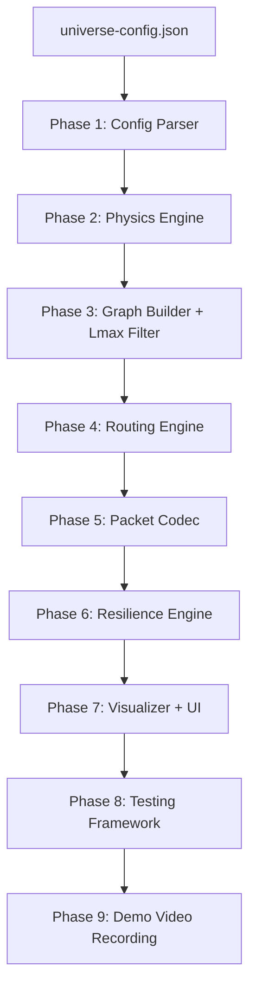
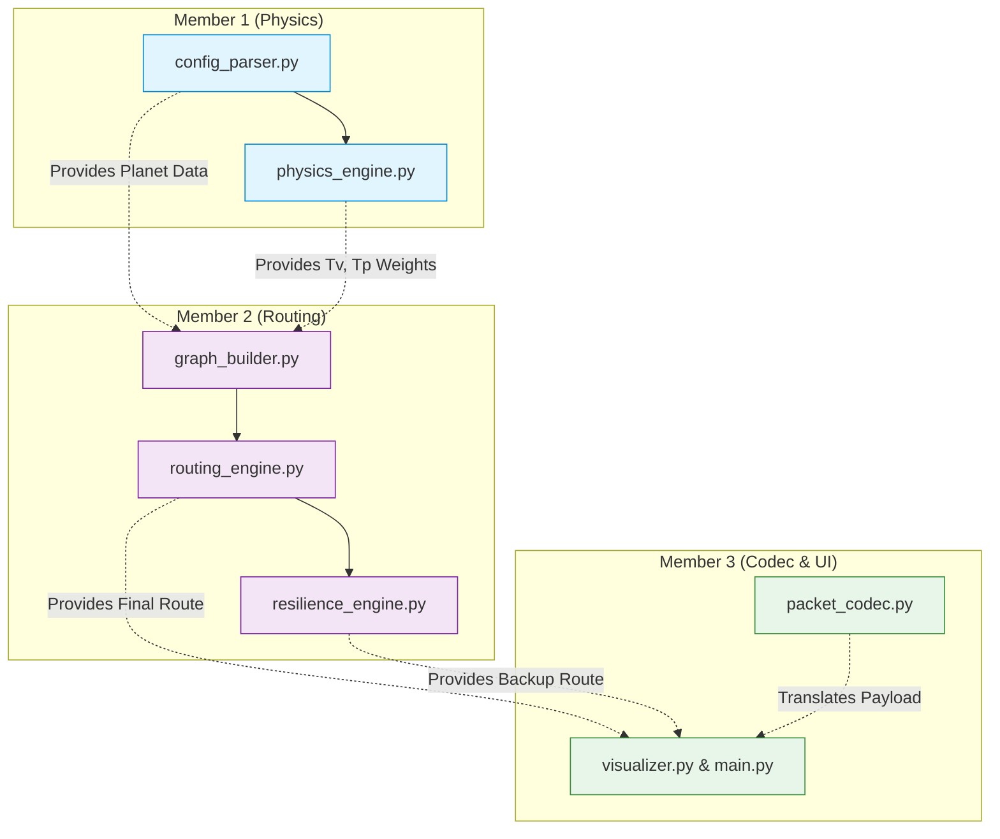

# Relic Ring Protocol — End-to-End Implementation Plan

> **Challenge:** Launch 26 Phase 01 — IEEE CS University of Kelaniya  
> **Objective:** Build a routing protocol simulator for the Zeta-26 star system  
> **Architecture:** 3-Layer Engine (Dijkstra → A* → Yen's K-paths)

---

## Architecture Overview



---

## Phase 1 — Config Parser (`config_parser.py`)

**Goal:** Dynamically load `universe-config.json`. Zero hardcoded constants.

### What to build
- Parse `universe_metadata` → extract all physical constants
- Parse `nodes[]` → build planet objects with all properties
- Apply defaults if any metadata field is missing:
  - `speed_of_light_kms` → default `300000.0`
  - `max_void_hop_distance_km` → default `50000000.0`
  - `coordinate_scale_unit_km` → must exist (no default)
  - `tower_processing_delay_ms` → default `7.0`
  - `fiber_speed_fraction` → default `0.67`

### Data structures

```python
@dataclass
class UniverseMetadata:
    system_name: str
    speed_of_light_kms: float        # C
    max_void_hop_distance_km: float  # Lmax
    coordinate_scale_unit_km: float  # S
    tower_processing_delay_ms: float # Δt
    fiber_speed_fraction: float      # f

@dataclass
class Planet:
    id: str
    codex: int           # numerical base for receiving
    x: float             # abstract grid coordinate
    y: float             # abstract grid coordinate
    radius_km: float     # NOT scaled
    active_towers: int   # N (≥ 4)
    atmosphere_thickness_km: float  # h
    refraction_index: float         # n
    is_active: bool = True          # for chaos test
```

### Key rules
- `x, y` are in abstract units → multiply by `coordinate_scale_unit_km` for km
- `radius_km` is already in km → do NOT scale it
- Validate: `active_towers >= 4`, `codex >= 2`, `refraction_index >= 1.0`

---

## Phase 2 — Physics Engine (`physics_engine.py`)

**Goal:** Pure math functions. No side effects. Independently testable.

### Formula 1: Void Distance (L)

From the support diagram:

```
L = sqrt((x2 - x1)² + (y2 - y1)²) × S - (R1 + h1) - (R2 + h2)
```

```python
import math

def void_distance(p1: Planet, p2: Planet, S: float) -> float:
    """Calculate void distance L between two planets in km."""
    dx = p2.x - p1.x
    dy = p2.y - p1.y
    center_dist = math.sqrt(dx**2 + dy**2) * S  # scale to km
    L = center_dist - (p1.radius_km + p1.atmosphere_thickness_km) \
                     - (p2.radius_km + p2.atmosphere_thickness_km)
    return max(L, 0.0)  # L cannot be negative
```

### Formula 2: Void Travel Time (Tv)

```
Tv = (h1 × n1) / C  +  L / C  +  (h2 × n2) / C
```

Atmospheric transit uses thickness `h` straight through (not slant path).

```python
def void_travel_time(p1: Planet, p2: Planet, L: float, C: float) -> float:
    """Calculate void travel time Tv in seconds."""
    atm_1 = (p1.atmosphere_thickness_km * p1.refraction_index) / C
    void  = L / C
    atm_2 = (p2.atmosphere_thickness_km * p2.refraction_index) / C
    return atm_1 + void + atm_2
```

### Formula 3: Internal Crust Transit Time (Tp)

Tower placement: N towers at equal angular intervals starting from top (positive y-axis), indices assigned clockwise (T_0 at top).

```
Tower_i angle = i × (360° / N)   (clockwise from +y axis)
```

For the closest tower pair (minimizes straight-line void distance between towers on each planet):

```
Tp = (s × 2πr / N) / (f × C)  +  m × Δt / 1000
```
- `s` = segments between entry and exit tower (shorter arc)
- `m` = distinct towers hit: `s + 1` in general; `1` if entry == exit (dedup)
- Result in seconds (convert Δt from ms)

```python
def tower_positions(planet: Planet) -> list[tuple[float, float]]:
    """Get (x, y) positions of all towers on a planet."""
    N = planet.active_towers
    positions = []
    for i in range(N):
        angle_rad = math.radians(i * (360.0 / N))  # clockwise from +y
        tx = planet.radius_km * math.sin(angle_rad)
        ty = planet.radius_km * math.cos(angle_rad)
        positions.append((tx, ty))
    return positions

def find_closest_tower_pair(p1: Planet, p2: Planet, S: float):
    """Find the tower pair that minimizes straight-line distance."""
    towers_1 = tower_positions(p1)
    towers_2 = tower_positions(p2)
    best_dist = float('inf')
    best_pair = (0, 0)
    for i, (tx1, ty1) in enumerate(towers_1):
        abs_x1 = p1.x * S + tx1
        abs_y1 = p1.y * S + ty1
        for j, (tx2, ty2) in enumerate(towers_2):
            abs_x2 = p2.x * S + tx2
            abs_y2 = p2.y * S + ty2
            d = math.sqrt((abs_x2 - abs_x1)**2 + (abs_y2 - abs_y1)**2)
            if d < best_dist:
                best_dist = d
                best_pair = (i, j)
    return best_pair

def crust_transit_time(planet: Planet, entry_tower: int, exit_tower: int,
                       f: float, C: float, delta_t_ms: float) -> float:
    """Calculate internal crust transit time Tp in seconds."""
    N = planet.active_towers
    raw_diff = abs(exit_tower - entry_tower)
    s = min(raw_diff, N - raw_diff)  # shorter arc
    m = 1 if s == 0 else s + 1      # tower dedup
    arc_distance = s * (2 * math.pi * planet.radius_km / N)
    fiber_time = arc_distance / (f * C)
    processing_time = m * (delta_t_ms / 1000.0)  # ms → seconds
    return fiber_time + processing_time
```

### End-to-End Route Latency

```
Total = Σ Tp(planet_i) + Σ Tv(hop_j)
```
- One `Tp` per planet visited (internal routing + tower delay)
- One `Tv` per void hop between consecutive planets
- No double-counting of Δt

---

## Phase 3 — Graph Builder (`graph_builder.py`)

**Goal:** Build a weighted adjacency graph with Lmax pre-filtering.

### Steps
1. For every planet pair `(A, B)`, compute `L = void_distance(A, B)`
2. If `L > Lmax` → **do NOT add edge** (pre-filter at architecture level)
3. If `L <= Lmax` → compute `Tv(A→B)` as the inter-planetary edge weight
4. For each planet, compute the closest tower pair for every neighbor
5. Store the full graph as an adjacency list

### Bridge detection (bonus)
At startup, identify "bridge" nodes whose removal disconnects the graph. Report these in the UI as single points of failure.

---

## Phase 4 — Routing Engine (`routing_engine.py`)

**Goal:** 3-layer algorithm stack.

| Layer | Algorithm | Purpose |
|---|---|---|
| Layer 1 | Dijkstra + min-heap | Core engine — OSPF standard, always optimal |
| Layer 2 | A* with Euclidean h(n) | Guided search — layered on top, same result but faster |
| Layer 3 | Yen's K=3 | Pre-computed backup pool for instant failover |

### A* Heuristic Admissibility Proof
- `h(n) = straight_line_distance(n, dest) / C`
- Actual path goes through atmosphere (refraction slows) and fiber (0.67c)
- Therefore `h(n)` always underestimates → provably admissible
- Include this proof in README

### Cross-Validation
Run Dijkstra and A* on all 30 directed planet pairs → assert identical path costs. If they ever differ, one implementation is wrong.

---

## Phase 5 — Packet Codec (`packet_codec.py`)

**Goal:** Handle all base conversions and build the mandatory packet schema.

### Conversion Flow (from spec example)

```
Origin Planet A (codex=8):
  "Hello world" → ASCII [72, 101, 108, ...]
  → Convert each to Next Hop's codex (Base 5): 72 → "242"
  → Serialize to binary stream → Beam via laser

Relay Planet B (codex=5):
  Receive binary → Read as Base 5 values
  → Decode back to ASCII for internal routing
  → Convert to Next Hop's codex (Base 14): 72 → "52"
  → Beam to next planet

Destination Planet C (codex=14):
  Receive binary → Read as Base 14 → Decode to ASCII
  → Display "Hello world"
```

### Mandatory Packet Schema

```python
@dataclass
class Packet:
    origin_id: str           # Source planet
    destination_id: str      # Destination planet
    current_id: str          # Current planet
    payload: str             # Raw message (show translations)
    hop_log: list[dict]      # Ordered array, appended at each relay
```

### hop_log entry format

```python
{
    "planet_id": "Boreas",
    "entry_tower": 2,
    "exit_tower": 0,
    "segments_traversed": 2,
    "towers_hit": 3,
    "fiber_time_s": 0.000234,
    "processing_time_s": 0.021,
    "crust_total_s": 0.021234,
    "void_distance_km": 18003445.0,
    "void_time_s": 0.06012,
    "payload_in_codex": ["242", "401", "413"],
    "codex_base": 5
}
```

---

## Phase 6 — Resilience Engine (`resilience_engine.py`)

**Goal:** Handle Chaos Test (M4) — kill nodes, instant reroute, no crash.

### Core mechanism
1. At startup: pre-compute K=3 routes for all 15 planet pairs (6C2)
2. `kill_node(id)`: mark dead → remove from graph → log convergence time in ms
3. `get_route(src, dst)`: check backup pool → serve first valid route that avoids dead nodes
4. `revive_node(id)`: bring back online → rebuild graph → flush pending DTN queue

### DTN Store-and-Forward (bonus)
If no route exists → queue the packet as "pending/undeliverable." When a dead node is revived, automatically flush the pending queue. Demonstrates full failure lifecycle.

---

## Phase 7 — Visualizer

**Goal:** Interactive UI for the demo video (M1–M4 milestones).

### Recommended: Python `Pygame` or HTML5 Canvas

### What to display
1. **Universe Map:** Planets as circles, towers as dots on circumference
2. **Edges:** Lines between Lmax-valid connected planets
3. **Packet Animation:** Glowing dot moving along route
4. **Latency Breakdown Panel:** Per-hop Tp, Tv table
5. **Codex Panel:** Payload translations at each hop
6. **Node Status:** Green = active, Red = dead
7. **hop_log Panel:** Scrollable log

### Demo Milestones Checklist

| Milestone | What to show | Duration |
|---|---|---|
| M1: Universe Init | Load JSON, render map, show edges + towers | 2 min |
| M2: Multi-Hop Proof | Send "Hello world" Aegis→Caelum, show codex at each hop | 3 min |
| M3: Latency Breakdown | Per-component table: fiber, tower, atm, void | 3 min |
| M4: Chaos Test | Kill a node, show instant reroute with new path | 3 min |

---

## Phase 8 — Testing Framework

| Test Category | What to verify |
|---|---|
| Physics Formulas | `void_distance(Aegis, Boreas)` ≈ 18,017,791 km |
| Lmax Boundary | No edge in graph has `L > 50,000,000 km` |
| Codex Round-Trip | `decode(encode("Hello world", base_N), base_N) == "Hello world"` for all bases |
| Cross-Validation | Dijkstra cost == A* cost for all 30 directed pairs |
| Chaos Reroute | Kill each of 6 planets → assert dead node never in route |
| Config Mutation | Double `coordinate_scale_unit_km` → verify L values scale proportionally |

---

## Phase 9 — Repository & Deliverables

### Folder Structure
```
relic-ring-protocol/
├── README.md
├── universe-config.json
├── src/
│   ├── config_parser.py
│   ├── physics_engine.py
│   ├── graph_builder.py
│   ├── routing_engine.py
│   ├── packet_codec.py
│   ├── resilience_engine.py
│   ├── visualizer.py
│   └── main.py
├── tests/
│   ├── test_physics.py
│   ├── test_codec.py
│   ├── test_routing.py
│   ├── test_resilience.py
│   └── test_config_mutation.py
└── docs/
    ├── algorithm_comparison.md
    └── latency_breakdown.md
```

### README.md must include
1. Setup and installation instructions
2. How to run the system
3. Justification of all assumed constants
4. Algorithm comparison table (Dijkstra vs A* vs Bellman-Ford)
5. A* heuristic admissibility proof
6. Bridge node analysis

---

## Execution Priority (Time-Boxing)

| Priority | Phase | Time | Risk if skipped |
|---|---|---|---|
| 🔴 Critical | Phase 2 — Physics Engine | Day 1 | All latency scores = 0 |
| 🔴 Critical | Phase 5 — Packet Codec | Day 1 | Baseline delivery fails |
| 🔴 Critical | Phase 3 — Graph Builder | Day 2 | No routing possible |
| 🔴 Critical | Phase 4 — Dijkstra only | Day 2 | No routing possible |
| 🟡 High | Phase 6 — Resilience | Day 3 | Lose Resilience score |
| 🟡 High | Phase 7 — Basic Visualizer | Day 3 | Demo video is weak |
| 🟢 Medium | Phase 4 — A* + Yen's K=3 | Day 4 | Miss differentiator |
| 🟢 Medium | Phase 8 — Full test suite | Day 4 | Risk hidden bugs |
| 🔵 Bonus | DTN store-and-forward | Day 5 | Nice-to-have |
| 🔵 Bonus | Bridge detection | Day 5 | Nice-to-have |

---

## Quick Reference: The 6-Planet Config

| Planet | Codex | Position | Radius (km) | Towers | Atmosphere (km) | Refraction |
|---|---|---|---|---|---|---|
| Aegis | Base 8 | (0, 0) | 6,371 | 8 | 120 | 1.0003 |
| Boreas | Base 5 | (150, 100) | 3,389 | 4 | 85 | 1.0520 |
| Dawn | Base 6 | (350, 50) | 1,500 | 6 | 30 | 1.0110 |
| Elysium | Base 10 | (300, 350) | 6,051 | 12 | 250 | 1.1850 |
| Fenix | Base 16 | (500, -100) | 1,200 | 4 | 15 | 1.0050 |
| Caelum | Base 14 | (650, 200) | 58,232 | 16 | 500 | 1.3210 |

> [!IMPORTANT]
> Caelum has a massive radius (58,232 km) — significant internal fiber transit time. Factor this into routing decisions.

---

## Team Collaboration Plan (3-Person Division)
To efficiently build this system and demonstrate strong team collaboration to the judges, divide the workload into three distinct roles. The system is designed so each person can build and unit-test their components in isolation before wiring them together.

### The Team Roles

**👤 Member 1: The Data & Physics Engineer (Foundation)**
*   **Focus:** Getting the universe loaded and the math perfect.
*   **Files:** `config_parser.py`, `physics_engine.py`
*   **Tasks:** Parse the JSON into dataclasses, implement the $L$, $T_v$, and $T_p$ formulas, and write aggressive unit tests against the physics engine.
*   **Blocks:** Unblocks Member 2 (Graph building relies on physics math).

**👤 Member 2: The Routing & Resilience Architect (Core Logic)**
*   **Focus:** The algorithms, graph theory, and the Chaos Test.
*   **Files:** `graph_builder.py`, `routing_engine.py`, `resilience_engine.py`
*   **Tasks:** Build the adjacency list (with $L_{max}$ pre-filtering), implement Dijkstra / A*, and build the `kill_node()` logic for instant rerouting.
*   **Blocks:** Unblocks Member 3 (UI needs the final routes to render).

**👤 Member 3: The Protocol & UI Developer (Deliverables & Demo)**
*   **Focus:** The packet translations and the final visual demo.
*   **Files:** `packet_codec.py`, `visualizer.py`, `main.py`
*   **Tasks:** Build the Base-N $\leftrightarrow$ ASCII translators, construct the `hop_log` schema, build the UI (Canvas/Pygame), and orchestrate the final demo video flow.

### Task Dependency Graph (Avoid Merge Conflicts)
Follow this critical path. Members can mock data (e.g., Member 2 can use fake $T_v$ values while Member 1 writes the physics engine) to work in parallel, but actual integration must follow this graph:


