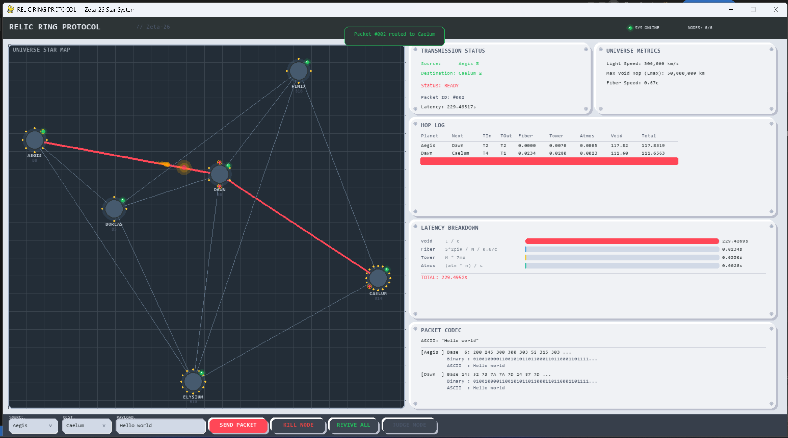
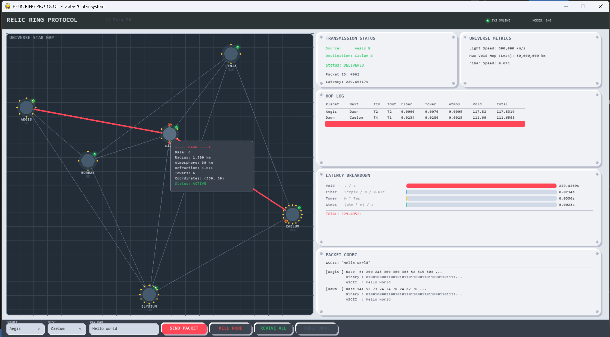
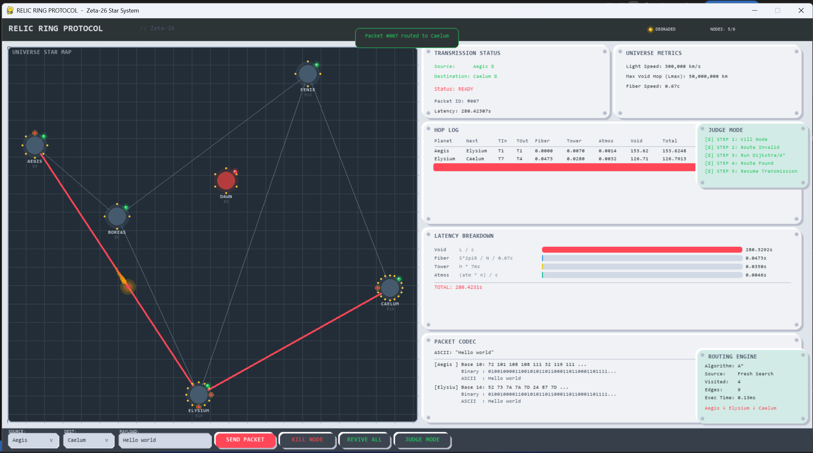
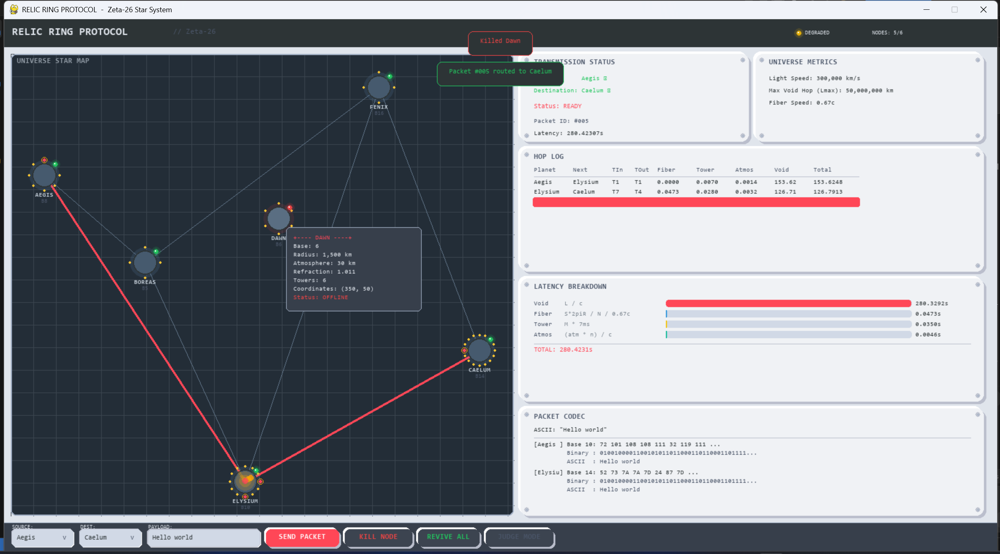
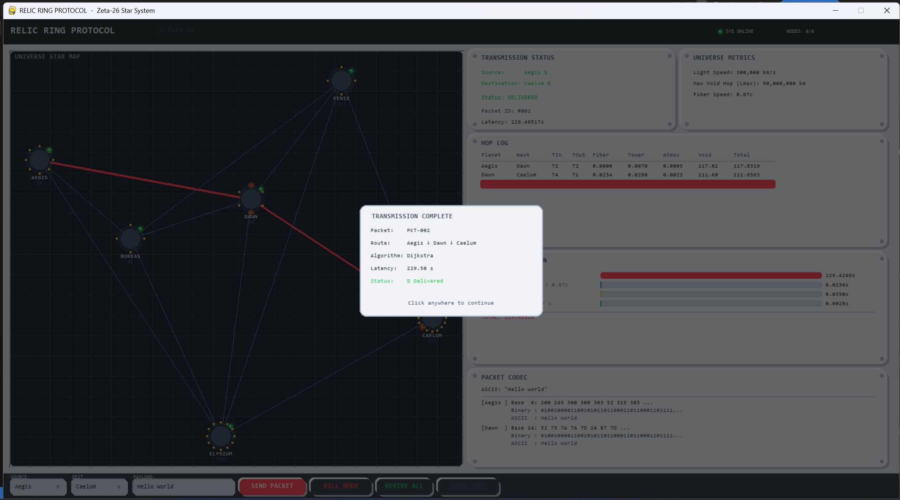

# Relic Ring Protocol - Zeta-26 Star System Routing Simulator

> **IEEE Computer Society - Launch 26 Phase 01 Challenge**  
> University of Kelaniya

An interplanetary routing protocol simulator that models data packet transmission across the Zeta-26 star system - a 6-planet network with Base-N codex translations, multi-hop latency calculations, and chaos-resilient routing.



## Quick Start

### Prerequisites
- Python 3.10+
- pygame-ce (`pip install pygame-ce`)

### Installation
```bash
pip install pygame-ce pytest
```

### Running the Demo
```bash
# Interactive GUI mode (recommended for demo video)
python relic-ring-protocol/src/main.py

# Terminal-only mode (all milestones verified)
python relic-ring-protocol/src/main.py --headless

# Run all tests
python -m pytest relic-ring-protocol/tests/ -v
```

## Features Implemented

### 1. Robust Network & Physics Modeling
- **Physics Engine**: Implements Distance (L), Void Travel Time (Tv), and Crust Transit (Tp) formulas with extreme precision.
- **Dynamic Graph Builder**: Maps hyperspace topology and calculates adjacency matrices based on the `Lmax` constraint.
- **Node Validation**: Strictly models planetary environments including atmosphere thicknesses and refraction indices.

### 2. Advanced Routing & Resilience
- **Dijkstra & A* (OSPF Standard)**: Cross-validated shortest-path algorithms. A* utilizes a provably admissible heuristic based on the speed of light.
- **Yen's K=3 Shortest Paths**: Pre-computes alternative routes for O(1) failover when chaos events strike.
- **Strict Endpoint Failure Logic**: Simulates transmission blockage if the source/destination is offline during pre-flight checks, and supports **mid-flight aborts** if endpoints are killed while a packet is actively in transit.

### 3. Industrial Skeuomorphism UI (Pygame)
- **Neumorphic Design System**: Uses customized `NeuButton`, drop-shadows, and `draw_card_with_screws` to present a clean, tactile control panel layout.
- **Hover Tooltips**: Instantly inspect any node's properties (Codex, Towers, Refraction, Active Status) simply by hovering over it on the star map.


- **Interactive Routing Engine**: Live metrics on the bottom-right panel displaying the chosen algorithm, visited nodes, edges checked, and execution time (ms).

### 4. Special Modes
- **Judge Mode**: A dedicated mode built specifically for evaluation. Enabling it visually breaks down the transmission lifecycle step-by-step using a dedicated Sequence Indicator Checklist floating on the right side.


- **Chaos Mode**: Click `KILL NODE` and select any planet on the map to take it offline. Instantly triggers dynamic route re-calculation (or transmission aborts depending on endpoint relevance).



### 5. Deep Packet Inspection & Reporting
- **Multi-Base Codex Engine**: Translates payloads from Base 10 (ASCII) into planetary Bases (e.g., Base 16, Base 8, Base 14) and logs the exact string sent across the void.
- **Hop Log**: Visualizes the exact entry and exit towers used on each planet as the packet travels.
- **Transmission Status Panel**: Replaces binary booleans with a full lifecycle Enum state-machine (`READY`, `BLOCKED`, `IN_TRANSIT`, `DELIVERED`, `ABORTED`, `UNDELIVERABLE`, `FAILED`).


- **Auto-Reports**: Generates `.txt` reports in the `reports/` folder capturing the entire journey summary per packet.

## Architecture

The system is a modular 9-phase pipeline:

```
universe-config.json
        |
        v
[1. Config Parser] --> Planet & Metadata objects
        |
        v
[2. Physics Engine] --> L, Tv, Tp calculations
        |
        v
[3. Graph Builder] --> Adjacency list (Lmax-filtered)
        |
        v
[4. Routing Engine] --> Dijkstra + A* (cross-validated)
        |
        v
[5. Resilience Engine] --> Yen's K=3 + Kill/Revive + DTN
        |
        v
[6. Packet Codec] --> Base-N <-> ASCII translation + hop_log
        |
        v
[7. Visualizer] --> Pygame Industrial Skeuomorphism UI
        |
        v
[8. Main Orchestrator] --> Demo flow (M1-M4)
        |
        v
[9. Test Suite] --> 25 automated tests
```

### Module Dependency Graph
```
config_parser.py  <-- physics_engine.py
       |                    |
       v                    v
graph_builder.py --> routing_engine.py
                           |
                           v
                  resilience_engine.py
                           |
                           v
                    packet_codec.py
                           |
                           v
                    visualizer.py <-- main.py
```

## Source Files

| File | Purpose | Owner |
|---|---|---|
| `src/config_parser.py` | Parses `universe-config.json` into typed dataclasses with validation | Member 1 |
| `src/physics_engine.py` | Implements L, Tv, Tp formulas with 9-decimal precision | Member 1 |
| `src/graph_builder.py` | Builds adjacency list, finds optimal tower pairs, detects bridges | Member 2 |
| `src/routing_engine.py` | Dijkstra + A* with shared `_build_hop_log_entry()` utility | Member 2 |
| `src/resilience_engine.py` | Yen's K=3 shortest paths, kill/revive nodes, DTN queue | Member 2 |
| `src/packet_codec.py` | Base-N translators, Packet schema, hop_log enrichment, TransmissionStatus | Member 3 |
| `src/visualizer.py` | Pygame Industrial Skeuomorphism interactive UI | Member 3 |
| `src/main.py` | Demo orchestrator for M1-M4 milestones | Member 3 |

## Algorithm Justification

### Why Dijkstra? (OSPF Standard)
Dijkstra's algorithm is the industry standard for shortest-path routing in real-world OSPF (Open Shortest Path First) protocols. It provides:
- **Guaranteed optimality** for non-negative edge weights
- **O((V+E) log V)** time complexity with binary heap
- **Deterministic results** for reproducible latency calculations

### A* Heuristic Admissibility Proof
The A* heuristic `h(n) = straight_line_distance(n, dest) / C` is **provably admissible**:
1. The shortest physical distance between two planets is a straight line
2. The fastest possible speed is the speed of light `C`
3. Actual paths traverse atmospheres (n > 1.0 slows light), fiber cables (0.67c), and incur tower processing delays (7ms each)
4. Therefore: `h(n) = distance/C <= actual_cost` always holds
5. Since h(n) never overestimates, A* is optimal

**Verification:** All 30 directed pairs cross-validated: Dijkstra cost == A* cost.

### Yen's K=3 for O(1) Failover
Pre-computing 3 shortest paths per source-destination pair enables instant failover when a node is killed during the Chaos Test, without re-running Dijkstra at failure time.

## Physical Constants

| Constant | Value | Source |
|---|---|---|
| Speed of Light (C) | 300,000 km/s | `universe-config.json` |
| Coordinate Scale (S) | 100,000 km/unit | `universe-config.json` |
| Max Void Hop (Lmax) | 50,000,000 km | `universe-config.json` |
| Tower Delay | 7.0 ms | `universe-config.json` |
| Fiber Speed Fraction | 0.67 | `universe-config.json` |

### Key Formulas
```
Void Distance:    L = sqrt((x2-x1)^2 + (y2-y1)^2) * S - (R1+h1) - (R2+h2)
Void Travel Time: Tv = (h1*n1)/C + L/C + (h2*n2)/C
Crust Transit:    Tp = fiber_distance/(0.67*C) + m * 0.007s
```

## The 6-Planet Universe

| Planet | Codex | Position | Radius (km) | Towers | Atmosphere | Refraction |
|---|---|---|---|---|---|---|
| Aegis | Base 8 | (0, 0) | 6,371 | 8 | 120 km | 1.0003 |
| Boreas | Base 5 | (150, 100) | 3,389 | 4 | 85 km | 1.0520 |
| Dawn | Base 6 | (350, 50) | 1,500 | 6 | 30 km | 1.0110 |
| Elysium | Base 10 | (300, 350) | 6,051 | 12 | 250 km | 1.1850 |
| Fenix | Base 16 | (500, -100) | 1,200 | 4 | 15 km | 1.0050 |
| Caelum | Base 14 | (650, 200) | 58,232 | 16 | 500 km | 1.3210 |

## Demo Video Guide

### M1: Universe Initialization
- App launches, loads `universe-config.json`
- Star map renders all 6 planets with tower dots
- All status LEDs show green
- Terminal shows cross-validation PASSED

### M2: Multi-Hop Routing Proof
1. Select Source: Aegis, Destination: Caelum
2. Payload field shows "Hello world" (default)
3. Click **SEND PACKET**
4. Watch the glowing packet animate along the route
5. Hop Log panel shows per-planet entry/exit towers
6. Codec panel shows Base-N translations at each hop

### M3: Latency Breakdown
- After sending a packet, the Latency panel auto-populates
- Bar chart shows Void (dominant), Fiber, and Tower components
- Total latency displayed at bottom

### M4: Chaos Test
1. Click **KILL NODE** (header shows "KILL MODE" LED)
2. Click a planet on the map (e.g., Dawn)
3. Planet turns red, edges become dashed
4. Route auto-reroutes avoiding the dead node
5. Packet integrity verified on new route
6. Click **REVIVE ALL** to restore
7. Original optimal route is restored

**Design Decision: Endpoint Failures**
If the Source or Destination node is killed *before* a transmission starts, the system blocks the request entirely without running routing algorithms. If either endpoint is killed *mid-flight* while a packet is in transit, the protocol instantly aborts the transmission since continuous availability of both endpoints is assumed for the duration of the transfer.

## Test Suite

25 automated tests across 4 test files:

```
tests/test_physics.py    - 5 tests (void distance, travel time, tower positions, crust transit)
tests/test_routing.py    - 6 tests (graph building, Dijkstra, A*, cross-validation, unreachable)
tests/test_resilience.py - 3 tests (Yen's K=3, kill/revive, DTN queue)
tests/test_codec.py      - 11 tests (base conversion, round-trips, spec examples, hop_log)
```

## Team

| Role | Responsibilities |
|---|---|
| **Member 1:** Data & Physics Engineer | `config_parser.py`, `physics_engine.py` |
| **Member 2:** Routing & Resilience Architect | `graph_builder.py`, `routing_engine.py`, `resilience_engine.py` |
| **Member 3:** Protocol & UI Developer | `packet_codec.py`, `visualizer.py`, `main.py`, `README.md` |
